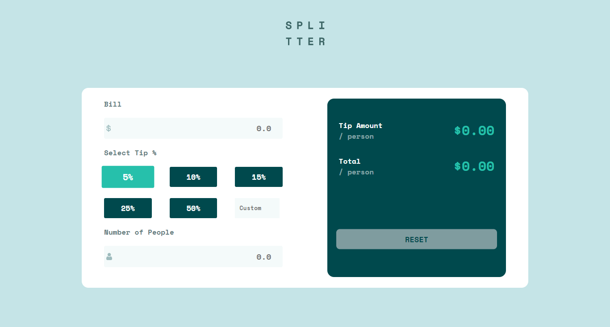

# Frontend Mentor - Tip calculator Solution

This is a solution to the [Tip calculator Challenge on Frontend Mentor](https://www.frontendmentor.io/challenges/tip-calculator-app-ugJNGbJUX). Frontend Mentor challenges help you improve your coding skills by building realistic projects.

## Table of contents

  - [Screenshot](#screenshot)
  - [Links](#links)
- [My process](#my-process)
  - [Built with](#built-with)
  - [What I learned](#what-i-learned)
  - [Continued development](#continued-development)
  - [Useful resources](#useful-resources)
- [Author](#author)

### Screenshot



### Links

- Solution URL: [Solution URL here](https://github.com/Hardy101/tipcalculator)
- Live Site URL: [Live site URL here](https://hardy101.github.io/tipcalculator/)

## My process

### Built with

- Semantic HTML5 markup
- CSS custom properties
- Flexbox
- Mobile-first workflow

### What I learned

Use this section to recap over some of your major learnings while working through this project. Writing these out and providing code samples of areas you want to highlight is a great way to reinforce your own knowledge.
My understanding of the foreach method was really enforced after completing this challenge

Especially Proud of this function:
```js
btn.forEach((btn) => {
  btn.addEventListener("click", handleClick);
});
function handleClick(event) {
  btn.forEach((btn) => {
    btn.classList.remove("active");
    if (event.target.innerHTML === btn.innerHTML) {
      btn.classList.add("active");
    }
    calculateBill();
    customBill.value = "";
  });
}
```

### Continued development

Completing this project made me realise the importance of learning CSS Grids, because using CSS flex in this challenge was a bit of a chore, so after this challenge i'll go work on my CSS skills

### Useful resources

- [Google Fonts](https://fonts.google.com/) - This helped me in searching for the font used as i didn`t have access to the figma files

## Author

- Frontend Mentor - [@Hardy101](https://www.frontendmentor.io/profile/Hardy101)
- Twitter - [@EghosaOrdia](https://twitter.com/EghosaOrdia)
